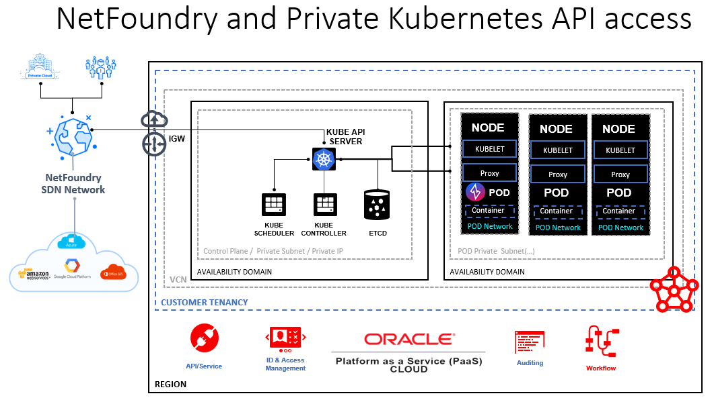

# Connecting to OKE Private API with NetFoundry Networking.

Oracle Cloud Infrastructure (OCI) & Oracle Container Engine for Kubernetes (OKE) reduces the operational burden of setting up and managing enterprise-grade Kubernetes clusters. NetFoundry and Oracle recognize that connecting to your Kubernetes cluster and its ecosystem is complex, so NetFoundry allows you to connect while also following Oracle best practice design principles:

* Secure by default: OKE hardens Kubernetes clusters following Enterprise Security best practices.

* Simplified Kubernetes operations: Oracle manages your cluster resources and automates recurrent Kubernetes administration and scaling tasks.

* High performance: Containerized applications run on high-performance Compute resources through OCI's non-blocking network.

Earlier in the year Oracle announced general availability of fully private Kubernetes clusters for Oracle Container Enginer for Kubernetes (OKE). This allows you to create fully private OKE clusters without having to expose public IP's. The standard method to connect is with FastConnect or VPN/Bastion connectivity.

What's New?

Oracle and technology partner NetFoundry have designed an alternative to circuit and VPN solutions using SDN cloud technology. NetFoundry provides Zero Trust Network connectivity for Edge, Multicloud, IOT and on premise infrastructure. [Here is more information on the NetFoundry Zero Trust Networking platform.](https://blogs.oracle.com/cloud-infrastructure/zero-trust-network-access-with-netfoundry)
The solution is 100% software and can be instantiated directly from the Oracle Cloud console and OCI CLI using HELM Charts to deploy NetFoundry software.

NetFoundry allows Administrators to configure a NetFoundry network to publish your Oracle Kubernetes cluster’s internal services. This is a programmable approach to secure access that makes traditional alternatives like IP allow lists, virtual private networks, and bastion hosts obsolete. This also means your OKE cluster could be in any VCN, it can reach out to the internet, and the master API server need not be exposed to the public internet.

You will deploy a NetFoundry endpoint as a pod on your Kubernetes cluster with a Helm chart. The endpoint may then be assigned in your NetFoundry network to host any services that are reachable inside your Kubernetes cluster. For example, the master API server used by kubectl, a Kubernetes dashboard, or any pod, service, or node IP or domain name you wish to expose to authorized remote apps, devices, or subnets.

Solution Diagram 

The diagram depicts a NetFoundry POD endpoint deployed with a Helm chart into the cluster. Remote connectivity to the Kubernetes API Server is forwarded through the NetFoundry overlay network to the POD endpoint. 

Basic Steps and More Information

1. [Create a Kubernetes cluster in your OCI account with at least one worker node.](https://docs.oracle.com/en-us/iaas/Content/ContEng/Tasks/contengcreatingclusterusingoke.htm)
2. [Install kubectl on the remote host for you will be using for administrative purposes.](https://kubernetes.io/docs/tasks/tools/)
3. [Install Helm, the package manager for Kubernetes.](https://helm.sh/docs/intro/quickstart/)
4. [Sign up for a free trial with NetFoundry](https://nfconsole.io/signup)

See the full demo quick start guide [here.](https://developer.netfoundry.io/guides/kubernetes/)

